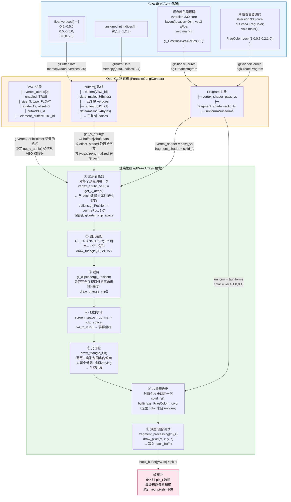
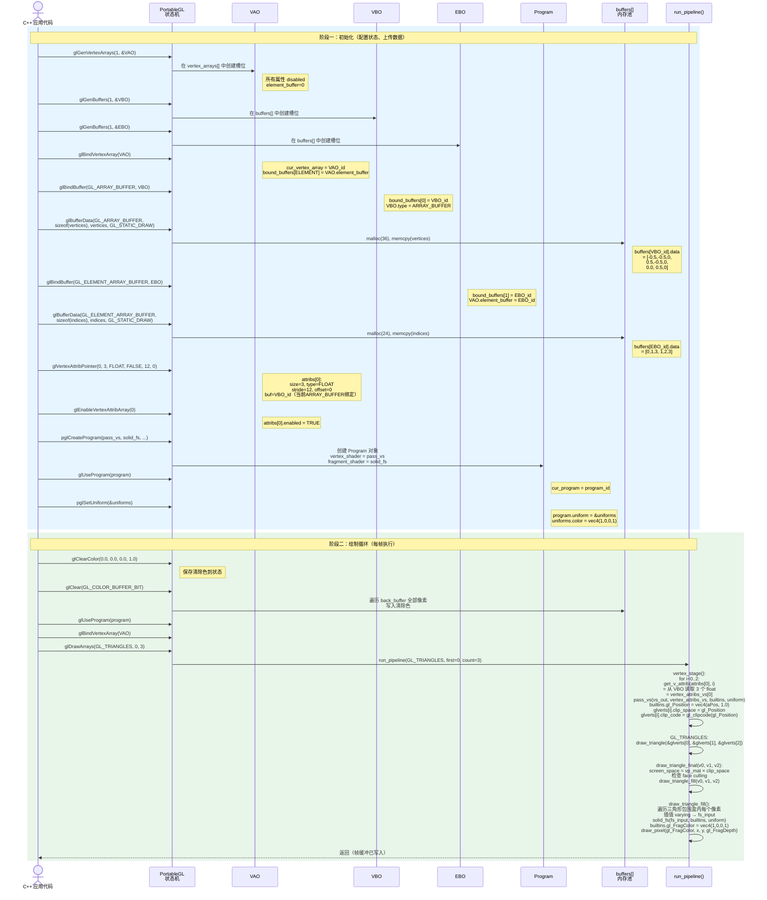
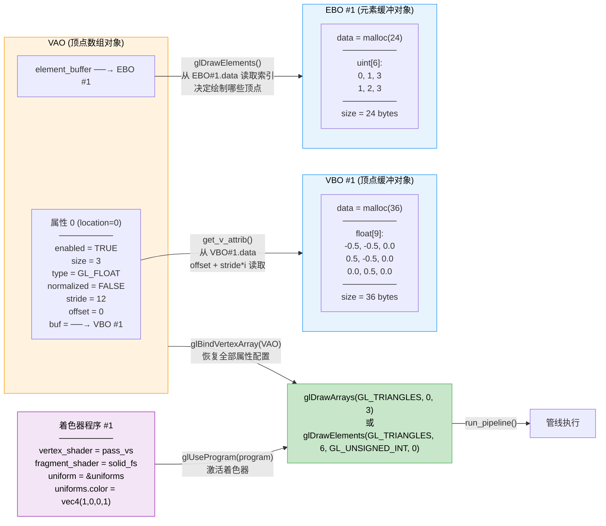

# 第 2 小时：Hello Triangle — 从窗口清屏到第一条渲染数据流

> 学习日期：2026-05-27
> 章节：`docs/01 Getting started/04 Hello Triangle.md`
> 示例：`demo-code/src/1.getting_started/2.1.hello_triangle/`、`2.2.hello_triangle_indexed/`
> 底层调试：`tools/portablegl-smoke/portablegl_smoke.c`
> Mesa 对照：`src/mesa/vbo/vbo_exec_draw.c`、`st_draw.c`、`sp_draw_arrays.c`

---

## 本节阅读方式

精读。这是第一次从窗口清屏进入真正绘制，必须建立 CPU 顶点数据到 GPU/软件管线的主干模型。

## 为什么这样读

第 1 小时已理解"OpenGL 是状态机"和"C++ 调用 -> 驱动/GPU -> framebuffer -> 屏幕"的大图。现在补全中间最难的一段：C++ 中的顶点数据如何变成屏幕上的像素。这段旅程之后每个主题都会反复走，但第一次必须走得足够清晰。

## 你阅读时重点看

1. 渲染管线各阶段的角色：顶点数据 -> 顶点着色器 -> 图元装配 -> 光栅化 -> 片段着色器 -> 深度/混合 -> 帧缓冲
2. VBO 的本质：GPU 端分配的一块内存，`glBufferData` 是"复制数据到 GPU 内存"
3. VAO 的本质：记录"顶点属性如何从 VBO 中抽取数据"的全部配置
4. `glVertexAttribPointer` 的六个参数
5. EBO 的本质：索引缓冲，用整数引用替代重复顶点
6. shader 编译链接流程
7. draw call 是触发点：`glDrawArrays` / `glDrawElements` 才真正启动管线

## 可以跳过或快速扫过

- 窗口初始化和 GLAD 加载代码（第 1 小时已覆盖）
- 线框模式 `glPolygonMode` 的细节（知道有这个功能即可）
- 练习题（本节后再做）

---

## 渲染管线全景

```
顶点数据 (CPU float数组)
    │
    ▼  glBufferData → VBO (GPU内存)
    │
    ▼  glVertexAttribPointer → VAO 记录"如何从VBO取数据"
    │
    ▼  glDrawArrays 触发管线开始
    │
    ▼  顶点着色器：每个顶点调用一次，输出 gl_Position
    │
    ▼  图元装配：把顶点连成三角形（或其他图元）
    │
    ▼  裁剪：丢弃视口外的部分
    │
    ▼  光栅化：三角形 → 一堆片段（候选像素）
    │
    ▼  片段着色器：每个片段调用一次，输出颜色
    │
    ▼  深度/模板/混合测试
    │
    ▼  帧缓冲 → 屏幕像素
```

**关键认知：** 管线是"拉"而不是"推"。CPU 不是逐像素告诉 GPU 该画什么；CPU 只是上传数据 + 配置状态 + 发出 draw call，然后 GPU 反过来拉取每个顶点、执行每个着色器、填充每个像素。

---

## 完整数据流图



---

## 初始化 + 绘制 时序图



---

## glDrawArrays 触发后的管线流程图

```mermaid
flowchart TD
    START["glDrawArrays(GL_TRIANGLES, 0, 3)"] --> RP["run_pipeline(GL_TRIANGLES, first=0, count=3)"]

    RP --> VS["vertex_stage()<br/>遍历 count 个顶点"]

    VS --> VS_LOOP{"i = 0, 1, 2"}
    VS_LOOP --> GVA["get_v_attrib(&attribs[0], i)"]
    GVA --> GVA_DETAIL["从 buffers[attrib.buf].data<br/>读取原始字节<br/>offset + stride × i<br/>按 type/size 解析为 vec4"]
    GVA_DETAIL --> CALL_VS["vertex_shader(vs_out,<br/>  vertex_attribs_vs,<br/>  &builtins, uniform)"]
    CALL_VS --> SAVE_VERT["保存到 glverts[i]:<br/>  clip_space = gl_Position<br/>  clip_code = gl_clipcode(gl_Position)<br/>  vs_out = 顶点着色器输出"]
    SAVE_VERT --> VS_LOOP

    VS_LOOP -->|"循环结束"| PRIM["根据 mode 分发"]

    PRIM -->|"GL_TRIANGLES"| TRI_LOOP["for i=0; i<count-2; i+=3"]
    TRI_LOOP --> DT["draw_triangle(v0, v1, v2)"]

    DT --> CLIP_CHECK{"c_and ≠ 0?<br/>三个顶点都在<br/>视口同一侧外"}
    CLIP_CHECK -->|"是"| DISCARD["丢弃三角形<br/>return"]
    CLIP_CHECK -->|"否"| CLIP_OR{"c_or ≠ 0?<br/>有顶点需要裁剪"}
    CLIP_OR -->|"否，全部在视口内"| FINAL["draw_triangle_final()"]
    CLIP_OR -->|"是，部分需要裁剪"| CLIP_SUB["draw_triangle_clip()"]

    FINAL --> VP["视口变换<br/>screen_space = vp_mat × clip_space<br/>v4_to_v3h() → 屏幕坐标"]
    VP --> FACE_CULL{"面剔除检查<br/>is_front_facing()"}
    FACE_CULL -->|"背面剔除<br/>且被剔除"| DISCARD2["return"]
    FACE_CULL -->|"通过"| FILL["draw_triangle_fill()<br/>或 draw_triangle_line/<br/>draw_triangle_point<br/>取决于 glPolygonMode"]

    FILL --> RASTER_LOOP["遍历三角形包围盒<br/>for y=min_y..max_y<br/>  for x=min_x..max_x"]
    RASTER_LOOP --> EDGE_TEST{"点(x,y)在<br/>三角形内？"}
    EDGE_TEST -->|"否"| NEXT_PIXEL["跳过"]
    EDGE_TEST -->|"是"| INTERP["插值 varying<br/>setup_fs_input()<br/>smooth/noperspective/flat"]
    INTERP --> DEPTH_TEST_PRE{"fragment_processing(x,y,z)?<br/>深度/模板测试"}
    DEPTH_TEST_PRE -->|"未通过"| NEXT_PIXEL2["跳过"]
    DEPTH_TEST_PRE -->|" 通过 "| CALL_FS["fragment_shader(fs_input, &builtins, uniform)"]
    CALL_FS --> DISCARD_Q{"builtins.discard?"}
    DISCARD_Q -->|"是"| NEXT_PIXEL3["跳过（discard）"]
    DISCARD_Q -->|"否"| DP["draw_pixel(gl_FragColor, x, y, z, fragdepth_or_discard)"]
    DP --> BLEND{"混合启用？"}
    BLEND -->|"是"| BLEND_PIX["blend_pixel(cf, dest_color)<br/>混合公式计算"]
    BLEND -->|"否"| CLAMP_PIX["clamp_01_v4(cf)<br/>直接截断到0,1"]
    BLEND_PIX --> LOGIC_MASK["逻辑操作<br/>颜色掩码<br/>写回 back_buffer"]
    CLAMP_PIX --> LOGIC_MASK
    LOGIC_MASK --> RASTER_LOOP

    style START fill:#e3f2fd,stroke:#1565c0,color:#000
    style FILL fill:#c8e6c9,stroke:#2e7d32,color:#000
    style CALL_VS fill:#fff9c4,stroke:#f9a825,color:#000
    style CALL_FS fill:#fff9c4,stroke:#f9a825,color:#000
    style DISCARD fill:#ffcdd2,stroke:#c62828,color:#000
    style DISCARD2 fill:#ffcdd2,stroke:#c62828,color:#000
    style DP fill:#e1bee7,stroke:#6a1b9a,color:#000
```



---

## VAO/VBO/EBO 关系图



---

## 程序思路详解

### 初始化阶段：把配置和数据"录制"进状态机

**核心认知：OpenGL 的初始化不是"执行命令"，而是"配置状态"。** `glGenBuffers`、`glBindBuffer`、`glBufferData` 这些函数不会画任何东西，它们只是在状态机中记录信息。

PortableGL 用一个全局 `glContext`（代码中的 `c`）来维护所有状态。

#### `glGenBuffers(1, &VBO)` — `portablegl.h:8710`

在 `c->buffers[]` 动态数组中分配一个空槽位，返回 ID。此时 `data = NULL`，没有实际内存。类比：拿到一个空箱子编号。

#### `glBindBuffer(GL_ARRAY_BUFFER, VBO)` — `portablegl.h:8837`

做两件事：

1. `c->bound_buffers[0] = VBO` — 记录"当前 ARRAY_BUFFER 目标绑定的是 VBO_id"
2. `c->buffers[VBO_id].type = 0` — 标记这个 buffer 的类型

**这是 OpenGL 状态机最核心的设计模式：绑定。** 绑定不是"把数据粘上去"，而是"告诉状态机，接下来对 `GL_ARRAY_BUFFER` 的操作，指向 VBO"。

#### `glBufferData(GL_ARRAY_BUFFER, sizeof(vertices), vertices, GL_STATIC_DRAW)` — `portablegl.h:8858`

真正分配内存并复制数据：

```c
u8* tmp = PGL_REALLOC(c->buffers.a[c->bound_buffers[target]].data, size);
memcpy(c->buffers.a[c->bound_buffers[target]].data, data, size);
```

它找到当前绑定在 `GL_ARRAY_BUFFER` 上的 buffer，`realloc` 分配内存，然后 `memcpy` 把 CPU 的 `vertices` 数组完整拷贝到 `buffers[VBO_id].data`。

#### `glBindVertexArray(VAO)` — `portablegl.h:8829`

```c
c->cur_vertex_array = array;
c->bound_buffers[GL_ELEMENT_ARRAY_BUFFER - GL_ARRAY_BUFFER] = 
    c->vertex_arrays.a[array].element_buffer;
```

设当前 VAO，同时恢复 VAO 记录的 EBO 绑定。

#### `glVertexAttribPointer(0, 3, GL_FLOAT, GL_FALSE, 12, 0)` — `portablegl.h:9644`

```c
glVertex_Attrib* v = &(c->vertex_arrays.a[c->cur_vertex_array].vertex_attribs[index]);
v->size = size;           // 3
v->type = type;           // GL_FLOAT
v->normalized = normalized; // GL_FALSE
v->stride = stride ? stride : size * type_sz;  // 12
v->offset = (GLsizeiptr)pointer;  // 0
v->buf = c->bound_buffers[GL_ARRAY_BUFFER - GL_ARRAY_BUFFER];  // 当前绑定的 VBO!
```

注意最后一行 `v->buf = c->bound_buffers[...]`——**`glVertexAttribPointer` 不仅记录格式，还记录了此时绑定在 `GL_ARRAY_BUFFER` 上的 VBO 的 ID。**

#### `glEnableVertexAttribArray(0)` — `portablegl.h:9696`

```c
c->vertex_arrays.a[c->cur_vertex_array].vertex_attribs[index].enabled = GL_TRUE;
```

简单地把属性 0 的 `enabled` 标记为 TRUE。

#### `glBindBuffer(GL_ELEMENT_ARRAY_BUFFER, EBO)` 在 VAO 绑定期间

```c
if (target == GL_ELEMENT_ARRAY_BUFFER - GL_ARRAY_BUFFER) {
    c->vertex_arrays.a[c->cur_vertex_array].element_buffer = buffer;
}
```

EBO 的绑定被 VAO 自动记录！解绑 VAO 前不能解绑 EBO。

### 绘制阶段：`glDrawArrays` 触发完整管线

`glDrawArrays(GL_TRIANGLES, 0, 3)` 只有一行有效代码：

```c
run_pipeline(mode, (GLvoid*)(GLintptr)first, count, 0, 0, GL_FALSE);
```

#### 阶段一：`vertex_stage()` — 从 VBO 读取顶点数据，执行顶点着色器

```c
glVertex_Attrib* v = c->vertex_arrays.a[c->cur_vertex_array].vertex_attribs;
for (i=0; i<GL_MAX_VERTEX_ATTRIBS; ++i) {
    if (v[i].enabled) enabled[j++] = i;
}
for (vert=0, i=first; i<first+count; ++i, ++vert) {
    do_vertex(v, enabled, num_enabled, i, vert);
}
```

`do_vertex()` 对每个顶点：

1. **`get_v_attrib()`**：根据 VAO 中记录的属性描述，从 `buffers[v->buf].data` 中第 i 个顶点的位置读取原始字节，按 type 转成 vec4。指针运算：`(u8*)(buf_data + v->offset + v->stride * i)`
2. **调用 `vertex_shader()`**：用户定义的 `pass_vs`，结果存入 `glverts[vert].clip_space`

#### 阶段二：图元装配

```c
for (i=0; i<count-2; i+=3) {
    draw_triangle(&c->glverts.a[i], &c->glverts.a[i+1], &c->glverts.a[i+2], i+provoke);
}
```

每 3 个顶点组装成一个三角形。

#### 阶段三：裁剪 — `draw_triangle()`

```c
c_and = v0->clip_code & v1->clip_code & v2->clip_code;
if (c_and != 0) return;  // 全部在视口外
c_or = v0->clip_code | v1->clip_code | v2->clip_code;
if (c_or == 0)
    draw_triangle_final(v0, v1, v2, provoke);  // 全部在视口内
else
    draw_triangle_clip(v0, v1, v2, provoke, 0);  // 部分裁剪
```

#### 阶段四：视口变换 — `draw_triangle_final()`

```c
v0->screen_space = mult_m4_v4(c->vp_mat, v0->clip_space);
v1->screen_space = mult_m4_v4(c->vp_mat, v1->clip_space);
v2->screen_space = mult_m4_v4(c->vp_mat, v2->clip_space);
```

然后检查面剔除，根据正面/背面选择不同的光栅化函数。

#### 阶段五：光栅化 — `draw_triangle_fill()`

遍历三角形包围盒内每个像素 (x, y)：

1. 判断点是否在三角形内
2. 插值 varying → `fs_input`
3. 设置 `builtins.gl_FragCoord`
4. 调用 `fragment_shader(fs_input, &builtins, uniform)`
5. 如果没有 discard：`draw_pixel(gl_FragColor, x, y, gl_FragDepth, ...)`

#### 阶段六：片段着色器

```c
static void solid_fs(float* fs_input, Shader_Builtins* builtins, void* uniforms)
{
    builtins->gl_FragColor = ((Uniforms*)uniforms)->color;
}
```

极简实现：忽略插值输入，直接从 uniform 取颜色。

#### 阶段七：`draw_pixel()` — 写入帧缓冲

```c
static void draw_pixel(vec4 cf, int x, int y, float z, int do_frag_processing)
{
    if (do_frag_processing && !fragment_processing(x, y, z)) return;
    pix_t* dest_loc = &((pix_t*)c->back_buffer.lastrow)[-y*c->back_buffer.w + x];
    // 混合或直接写入
    *dest_loc = src;
}
```

最终像素写入位置：`back_buffer` 中 (x, y) 处。

### `red_pixels=968` 的完整来历

1. 顶点数据：`{-0.7, -0.7, 0.0}, {0.7, -0.7, 0.0}, {0.0, 0.7, 0.0}`（NDC 坐标）
2. 顶点着色器直通：`gl_Position = vec4(aPos, 1.0)`
3. 视口变换：64×64 帧缓冲，NDC [-1,1] 映射到像素 [0,64)
4. 光栅化：在 64×64 帧缓冲中，这个三角形覆盖了 968 个像素
5. 片段着色器：`gl_FragColor = vec4(1.0, 0.0, 0.0, 1.0)` — 纯红
6. `draw_pixel()`：混合未启用，直接 clamp + 写入
7. 后扫描：968 个像素满足 `color.r > 200 && color.g < 50 && color.b < 50`

---

## Mesa softpipe 对照

```
C++ 调用 glDrawArrays()
  → OpenGL 驱动入口
  → Mesa: vbo_exec_draw_arrays()     (vbo/vbo_exec_draw.c)
  → st_draw_vbo()                    (state_tracker/st_draw.c)
  → softpipe: softpipe_draw_vbo()    (softpipe/sp_draw_arrays.c)
  → draw_vbo() → draw模块处理顶点
  → 软件光栅化
```

Mesa 和 PortableGL 的核心管线逻辑完全一致，区别在于：
- Mesa 经过完整的 Gallium3D 架构（state_tracker → pipe_context → softpipe），层次更多
- Mesa 的 shader 经过 NIR 编译，PortableGL 的 shader 直接是 C 函数指针
- Mesa 支持全部 OpenGL 功能，PortableGL 是教学用子集

但**数据流模型**完全相同：CPU 传数据 → 状态机配置格式 → 顶点着色器 → 图元装配 → 光栅化 → 片段着色器 → 帧缓冲。

---

## PortableGL vs Mesa softpipe 对照表

| 概念 | PortableGL 实现 | Mesa softpipe 入口 |
|---|---|---|
| 状态机 | `glContext c`（全局结构体） | `GLcontext` / `st_context` |
| VBO 创建 | `glGenBuffers` → `c->buffers[]` 分配槽位 | `vbo_create_buffer` → GPU buffer object |
| VBO 数据上传 | `glBufferData` → `PGL_REALLOC + memcpy` | `st_buffer_data` → 资源映射和写入 |
| VAO 属性配置 | `glVertexAttribPointer` → 写入 `vertex_attribs[index]` 的 size/type/stride/offset/buf | `st_atom_array.c` → `pipe_vertex_element` 设置 |
| Draw call 入口 | `glDrawArrays` → `run_pipeline()` | `vbo_exec_draw_arrays` → `st_draw_vbo` → `softpipe_draw_vbo` |
| 顶点提取 | `get_v_attrib()` → 直接指针运算读 VBO 内存 | `draw_vbo()` → `draw_arrays()` → 逐顶点从映射 buffer 读取 |
| 顶点着色器 | C 函数指针 `pass_vs()` 直接调用 | NIR 编译后的 shader 执行 |
| 图元装配 | `run_pipeline()` 中按 mode 遍历顶点组成三角形 | `draw_pipe_prim.c` → 图元装配 |
| 裁剪 | `gl_clipcode` + `draw_triangle_clip` | `draw_clip.c` → Sutherland-Hodgman 裁剪 |
| 视口变换 | `mult_m4_v4(vp_mat, clip_space)` | `st_atom_viewport.c` 设置 viewport |
| 光栅化 | `draw_triangle_fill()` 逐像素扫描 | `sp_quad_fs.c` → 每个四边形片段处理 |
| 片段着色器 | C 函数指针 `solid_fs()` 直接调用 | `sp_fs_exec.c` → 执行编译后的 fragment shader |
| 深度测试 | `fragment_processing()` → `depthtest()` | `sp_quad_depth_test.c` |
| 写入帧缓冲 | `draw_pixel()` → `back_buffer[y*w+x] = src` | softpipe 的 `sp_surface.c` → 写入 resource |

---

## 闭卷检查

1. **为什么需要 VAO？** 核心模式下不绑定 VAO 拒绝绘制。VAO 保存了顶点属性的全部配置（哪个属性启用、格式、步长、偏移、关联的 VBO），绑定 VAO 一步恢复所有状态。
2. **`glVertexAttribPointer` 记录了什么？** 它记录"如何从 VBO 的原始字节中提取顶点属性"——location、分量数、数据类型、是否归一化、步长、偏移。**关键：它还记住了当时绑定在 `GL_ARRAY_BUFFER` 上的 VBO。**
3. **VBO 和 EBO 在管线中的角色有什么区别？** VBO 存顶点属性数据（坐标、颜色、法线等），被 VAO 的属性描述引用；EBO 存索引数据（引用哪些顶点组成图元），被 `glDrawElements` 使用。EBO 的绑定也被 VAO 记录。
4. **顶点着色器的输入从哪来？输出到哪去？** 输入来自 VAO 配置的顶点属性（`in` 变量对应 `layout(location=N)`）；输出 `gl_Position` 到管线的图元装配和裁剪阶段，同时可通过 `out` 变量传递给片段着色器。
5. **片段着色器的输入从哪来？输出到哪去？** 输入来自顶点着色器的 `out` 变量（经光栅化插值后的值）；输出 `out vec4 FragColor` 到深度/混合测试，最终写入帧缓冲。
6. **`glDrawArrays(GL_TRIANGLES, 0, 3)` 执行后，发生了什么？** 触发 `run_pipeline`：vertex_stage 逐顶点从 VBO 提取数据并执行顶点着色器 → 图元装配组成三角形 → 裁剪 → 视口变换 → 光栅化生成片段 → 片段着色器计算颜色 → 深度/混合测试 → 写入帧缓冲。

## 数据流图总结

```
C++ 代码中 float vertices[9]
    │
    │ glBufferData → 复制到 GPU VBO 内存
    ▼
VBO (GPU 内存中的连续 float 数组)
    │
    │ VAO 记录: location=0, size=3, type=FLOAT, stride=12, offset=0, 绑定此 VBO
    ▼
顶点着色器: in vec3 aPos → gl_Position = vec4(aPos, 1.0)
    │                     (每个顶点调用一次)
    ▼
图元装配: 3 个顶点 → 1 个三角形
    │
    ▼
光栅化: 三角形 → N 个片段 (每个片段对应候选像素)
    │
    ▼
片段着色器: FragColor = vec4(1.0, 0.5, 0.2, 1.0)
    │                     (每个片段调用一次)
    ▼
深度/混合测试 → 帧缓冲像素 → 屏幕显示
```

## 常见错误

1. **没绑定 VAO 就画**：核心模式下黑屏，不绘制任何东西。
2. **`glVertexAttribPointer` 时绑定的不是目标 VBO**：属性读取到错误数据或段错误。
3. **忘记 `glEnableVertexAttribArray`**：属性被禁用，顶点着色器收到默认值（0,0,0,1），所有顶点重合到一点。
4. **着色器编译失败但没检查错误**：黑屏且无提示。始终用 `glGetShaderiv` / `glGetProgramiv` 检查。
5. **先解绑 VAO 再解绑 EBO**：`GL_ELEMENT_ARRAY_BUFFER` 的绑定被 VAO 记录。如果先解绑 EBO 再解绑 VAO，VAO 会丢失 EBO 引用。

## 下次复习点

1. VAO/VBO/EBO 的关系和绑定顺序
2. `glVertexAttribPointer` 的六个参数
3. shader 编译链接流程
4. PortableGL 中 `glDrawArrays` 到 `draw_pixel` 的完整路径